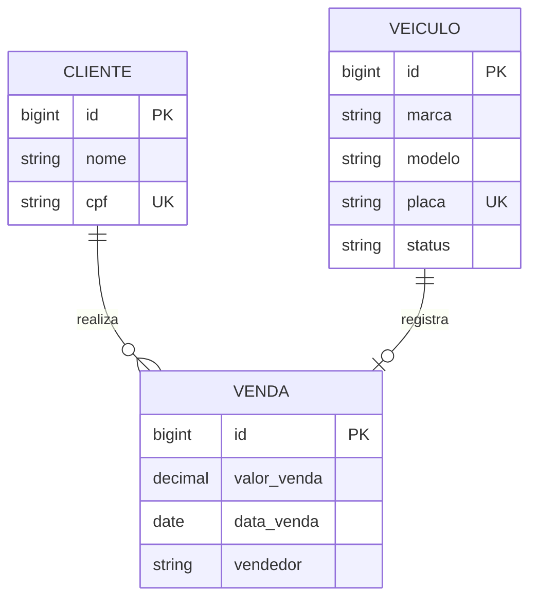

# 09 — Modelo conceitual (MER)

**Status:** Proposta (responsável: Lucas / back-end) · **Data:** 2026-09-10
**Base:** [02](02-modelo-de-dados.md), [04](04-contrato-de-api.md), [08](08-decisao-stack-back-end.md) e o escopo aprovado.

Nível **conceitual**: o quê existe e como se liga, sem tipos nem chaves estrangeiras (isso entra no
lógico/DER). Escopo aprovado = 3 entidades. O módulo financeiro (`lancamentos`, `financiamentos` do
[02](02-modelo-de-dados.md)) fica fora desta entrega.

## Diagrama

Versão vetorial do diagrama: [`assets/mer-autosystem.svg`](assets/mer-autosystem.svg).

## Entidades

- **Cliente** — quem compra. Identidade `id`; chave de negócio `cpf` (única).
- **Veículo** — o que está à venda. Identidade `id`; chave de negócio `placa` (única quando preenchida).
- **Venda** — **entidade associativa** que liga Cliente e Veículo e carrega atributos próprios
  (`valor_venda`, `data_venda`, `vendedor`). É entidade, não só relacionamento, porque tem
  identidade e atributos.

## Relacionamentos e cardinalidade (min, max)

| Relacionamento | Entidade | (min, max) | Leitura |
|---|---|---|---|
| **realiza** | Cliente | (0, N) | um cliente realiza de 0 a N vendas |
| **realiza** | Venda | (1, 1) | toda venda pertence a exatamente 1 cliente |
| **registra** | Venda | (1, 1) | toda venda registra exatamente 1 veículo |
| **registra** | Veículo | (0, 1) | um veículo é vendido em no máximo 1 venda |

O limite **`(0, 1)`** do veículo traduz, já no modelo, a regra *"veículo vendido não pode ser vendido
de novo"*. No físico vira `UNIQUE(veiculo_id)` em `vendas`.

## Decisões de modelagem

- `marca`/`modelo` como **colunas** (não tabelas-lookup): 3NF onde importa, sem over-normalizar para o
  porte do projeto.
- `vendedor` como **atributo texto** agora; vira `vendedor_id` quando entrar login (previsto no
  [02](02-modelo-de-dados.md)).
- Auditoria (`criado_em`/`atualizado_em`) fica fora do conceitual — entra no lógico/físico.

## Pendente de confirmação (produto)

1. `marca`/`modelo` como coluna ou tabela separada?
2. `vendedor` texto agora e `vendedor_id` depois — ok?
3. Sem recompra/revenda do mesmo veículo nesta entrega → manter `Veículo (0, 1)` / `UNIQUE(veiculo_id)`?

## Coerência com os docs anteriores

- **[02](02-modelo-de-dados.md):** mesma cardinalidade ("uma venda por veículo"); aqui restringido ao
  escopo (3 tabelas) e sem o `ENUM` nativo (ver [08](08-decisao-stack-back-end.md): `VARCHAR + CHECK`).
- **[04](04-contrato-de-api.md):** entidades e chaves batem com o contrato.

## Próximo passo

Fechadas as 3 decisões → **DER (lógico)**: todos os atributos, tipos e as FKs (`veiculo_id`,
`cliente_id`) explícitas.
